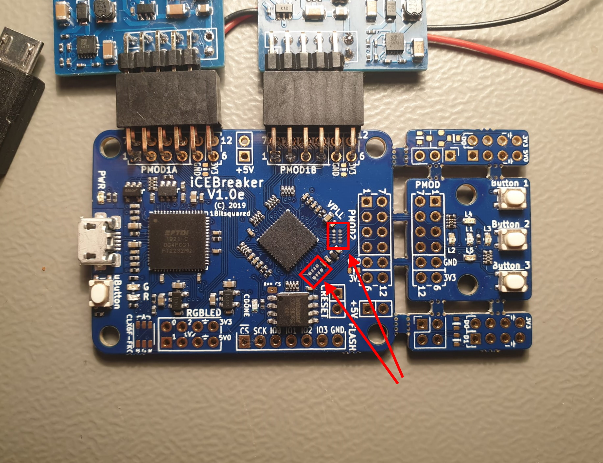

# iCEBreaker Mod

(Note: This is based on my v1.0e iCEBreaker board. I don't know if this is any different for other versions)

To be able to transmit all audio data, the FT2232H is used in FIFO mode.
Because this uses many pins in common with the PMOD2 connector, the devices on the break-off
section may interfere with the communication. 

Therefore the break-off section should either be broken-off, or the PMOD2 connection disconnected 
by removing the 2 Resistor Networks indicated below:

To be fair, I don't know if this would actually be a problem. I did not test it. 
