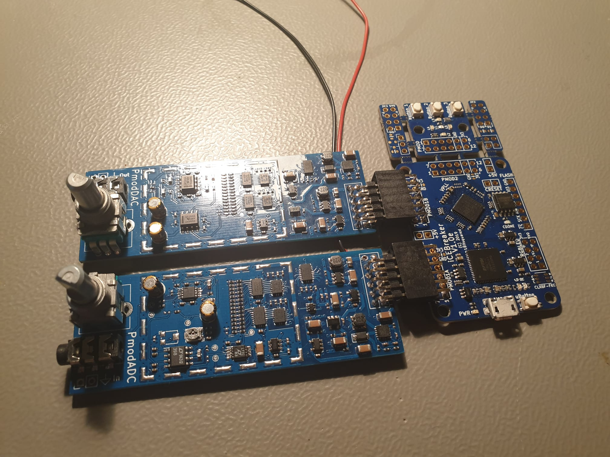

# PmodADC

### Philipp Schilk, 2020

## Description
A fully discrete 14bit, 44.1kHz, Successive-Approximation Audio ADC and 14bit 44.1kHz R2R Audio DAC 
controlled by a iCEBreaker FPGA board. 

(WIP)

